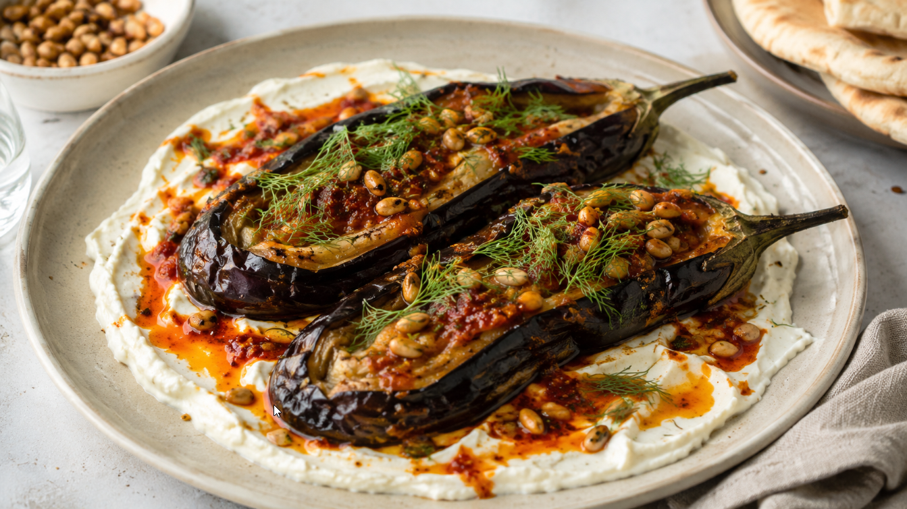

# Example: URL input (Ottolenghi recipe)

## Input

Paste the URL into the chat:

```
https://ottolenghi.co.uk/pages/recipes/burnt-aubergine-feta-harissa-oil
```

## Output

The parser extracts the recipe from the page, translates everything to Dutch, and outputs one JSON-LD object:

```json
{
  "@context": "https://schema.org",
  "@type": "Recipe",
  "name": "Geblakerde aubergine met feta en harissa-olie",
  "url": "https://ottolenghi.co.uk/pages/recipes/burnt-aubergine-feta-harissa-oil",
  "image": "https://ottolenghi.co.uk/cdn/shop/files/Burnt_aubergine_with_feta_and_harissa_oil.jpg?v=1758808283&width=1000",
  "description": "Geblakerde aubergine op een romige fetabasis met kruidige harissa-olie, geroosterde pijnboompitten en dille. Serveer eventueel met warme pita.",
  "recipeYield": "2 porties",
  "prepTime": "PT15M",
  "cookTime": "PT30M",
  "recipeCategory": [
    "Bijgerecht"
  ],
  "keywords": [
    "dieet | vegetarisch",
    "tijd | 30-60",
    "pittig | medium"
  ],
  "suitableForDiet": "https://schema.org/VegetarianDiet",
  "tool": [
    "grillpan",
    "rooster",
    "bakplaat",
    "kom",
    "mes",
    "vork"
  ],
  "recipeIngredient": [
    "60 ml olijfolie",
    "2 aubergines, ongeveer 500 g",
    "1 tl zeezoutvlokken",
    "30 g harissa",
    "1 el citroensap",
    "1 el ahornsiroop",
    "130 g feta",
    "50 ml volle melk",
    "15 g pijnboompitten, geroosterd",
    "1 el dille [vers], blaadjes geplukt",
    "pita, voor erbij (optioneel)"
  ],
  "recipeInstructions": [
    {
      "@type": "HowToStep",
      "text": "Zet een grillpan op hoog vuur en ventileer de keuken. Wrijf 1 el olijfolie over de aubergines."
    },
    {
      "@type": "HowToStep",
      "text": "Leg de aubergines in de zeer hete pan en rooster ze ongeveer 20 minuten; keer ze af en toe, tot ze rondom zwartgeblakerd zijn maar niet grijs en asachtig. Leg ze op een rooster boven een bakplaat en laat afkoelen."
    },
    {
      "@type": "HowToStep",
      "text": "Pel de aubergines zodra ze hanteerbaar zijn; gooi de verbrande schillen weg, maar laat de steeltjes zitten en houd het vruchtvlees zo heel mogelijk. Snijd elke aubergine met een klein mes van boven naar beneden in, zonder de uiteinden of de onderkant helemaal door te snijden."
    },
    {
      "@type": "HowToStep",
      "text": "Open de aubergines voorzichtig en bestrooi elke aubergine met 1/2 tl zout. Leg ze terug op het rooster, zodat overtollig vocht kan uitlekken."
    },
    {
      "@type": "HowToStep",
      "text": "Meng in een middelgrote kom de harissa met de resterende 45 ml olijfolie, het citroensap en de ahornsiroop. Zet apart."
    },
    {
      "@type": "HowToStep",
      "text": "Prak in een kleine kom de feta met de melk met een vork tot het mengsel redelijk glad is. Zet apart."
    },
    {
      "@type": "HowToStep",
      "text": "Schep voor het serveren al het fetamengsel op een groot bord met opstaande rand en strijk het met de achterkant van een lepel uit tot een cirkel, met een rand van 1.5 cm rondom. Bestrijk de aubergines met het harissamengsel en leg ze naast elkaar op de feta."
    },
    {
      "@type": "HowToStep",
      "text": "Schep het resterende harissamengsel over de aubergines, zodat de olie over de feta naar de rand van het bord loopt. Bestrooi met de pijnboompitten en dille, en serveer eventueel met warme pita."
    }
  ]
}
```

## What to notice

- **URL and image extracted.** The recipe URL is preserved and the main image is pulled from the page.
- **Dutch translation.** The English recipe is fully translated, including description and all steps.
- **Ingredient formatting.** `dille [vers]` uses square brackets for the DB qualifier (matches the Mealie ingredient database). Notes like `ongeveer 500 g` and `voor erbij (optioneel)` go after the comma or in round brackets.
- **Faceted tags.** `dieet | vegetarisch`, `tijd | 30-60`, `pittig | medium` follow the strict `{type} | {value}` format from the whitelist.
- **Category.** Classified as `Bijgerecht` based on the recipe content.
- **Tools.** Only tools explicitly mentioned or clearly implied by the recipe steps.
- **Times.** `prepTime` and `cookTime` from the source, normalized to ISO 8601.

## Generated image

After parsing, type `/image` to generate a food photo:


