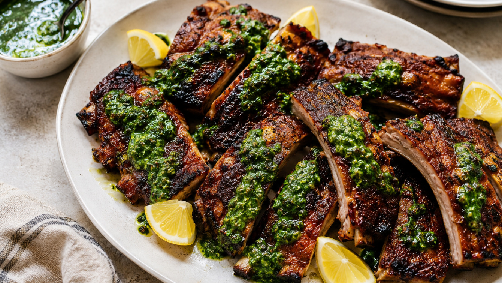

# Example: URL input (BBQ recipe with multiple categories)

## Input

```
https://ottolenghi.co.uk/pages/recipes/smokey-ribs-green-sauce
```

## Output

```json
{
  "@context": "https://schema.org",
  "@type": "Recipe",
  "name": "Rokerige varkensribben met groene saus",
  "url": "https://ottolenghi.co.uk/pages/recipes/smokey-ribs-green-sauce",
  "image": "https://ottolenghi.co.uk/cdn/shop/files/Smoky_ribs_with_green_sauce.jpg?v=1721732625&width=1000",
  "description": "Malse, rokerig gekruide varkensribben met een frisse groene saus van peterselie, koriander, knoflook en mosterd. Serveer als stevig hoofdgerecht van de barbecue.",
  "recipeYield": "4 porties",
  "prepTime": "PT5M",
  "cookTime": "PT2H",
  "recipeCategory": [
    "BBQ",
    "Hoofdgerecht"
  ],
  "keywords": [
    "tijd | 60+",
    "eiwit | varken",
    "pittig | mild"
  ],
  "tool": [
    "oven",
    "bakplaat",
    "keukenmachine",
    "grillpan",
    "pan",
    "kwast",
    "barbecue"
  ],
  "recipeIngredient": [
    "1.1 kg varkensribben (babybackribs)",
    "1 tl komijn [gemalen]",
    "1 tl zoet gerookt paprikapoeder",
    "1 tl aleppopeper",
    "2 el bruine suiker",
    "20 g peterselie, grof gehakt",
    "20 g koriander [blad], grof gehakt",
    "1 teentje knoflook, gepeld en geplet",
    "3 el olijfolie",
    "2 el plus 1 tl dijonmosterd",
    "2 el wittewijnazijn",
    "fijn zeezout, naar smaak",
    "zwarte peper [gemalen], naar smaak",
    "citroensap, om te serveren"
  ],
  "recipeInstructions": [
    {
      "@type": "HowToStep",
      "text": "Verwarm de oven voor op 160 °C."
    },
    {
      "@type": "HowToStep",
      "text": "Leg de ribben op een groot vel aluminiumfolie en breng op smaak met de komijn, het paprikapoeder, de aleppopeper, 2 tl bruine suiker, 1 tl zout en een flinke draai zwarte peper. Vouw de folie luchtdicht dicht, leg op een bakplaat en gaar 1 uur en 40 minuten, tot de ribben mals zijn maar nog niet van het bot vallen."
    },
    {
      "@type": "HowToStep",
      "text": "Doe intussen de peterselie, koriander, olijfolie, knoflook, 1 tl dijonmosterd en een snuf zout in de kleine kom van een keukenmachine. Pulseer 30 seconden tot alles gemengd is en zet apart."
    },
    {
      "@type": "HowToStep",
      "text": "Verhit, zodra de ribben gaar zijn, een grillpan op middelhoog tot hoog vuur. Leg de ribben op een snijplank en halveer elk rek."
    },
    {
      "@type": "HowToStep",
      "text": "Giet het kookvocht uit de folie in een kleine pan en voeg de resterende 2 el dijonmosterd, de wittewijnazijn en de resterende 4 tl bruine suiker toe. Kook 2 minuten op middelhoog tot hoog vuur, tot de glaze is ingekookt en dik genoeg is om de achterkant van een lepel te bedekken."
    },
    {
      "@type": "HowToStep",
      "text": "Bestrijk de ribben met een dunne laag glaze. Gril elke kant 30 seconden, tot er grillstrepen ontstaan, draai om en herhaal; doe dit 2 tot 3 keer, of tot alle glaze is gebruikt."
    },
    {
      "@type": "HowToStep",
      "text": "Leg de ribben op een serveerbord en schep de groene saus over elk stuk. Serveer met citroensap eroverheen gesprenkeld."
    }
  ]
}
```

## What to notice

- **Multiple categories.** `["BBQ", "Hoofdgerecht"]` shows how recipes can have up to 3 categories from the whitelist.
- **DB qualifiers.** `komijn [gemalen]`, `koriander [blad]`, and `zwarte peper [gemalen]` use square brackets to match Mealie ingredient database entries.
- **Protein tag.** `eiwit | varken` tags the main animal protein source. This tag is only used for non-vegetarian recipes.
- **Time tag.** `tijd | 60+` because total time exceeds 60 minutes (2h5m).
- **Foreign ingredient name.** `varkensribben (babybackribs)` keeps the common English term in round brackets as a note.
- **Temperature conversion.** The source temperature is converted to Celsius.
- **Spice level.** `pittig | mild` because aleppopeper adds mild heat but this is not a spicy dish.

## Generated image

After parsing, type `/image` to generate a food photo:


