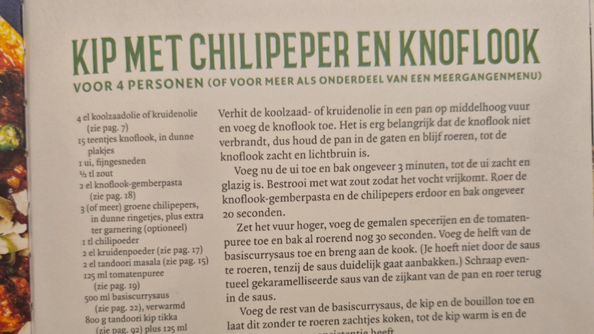
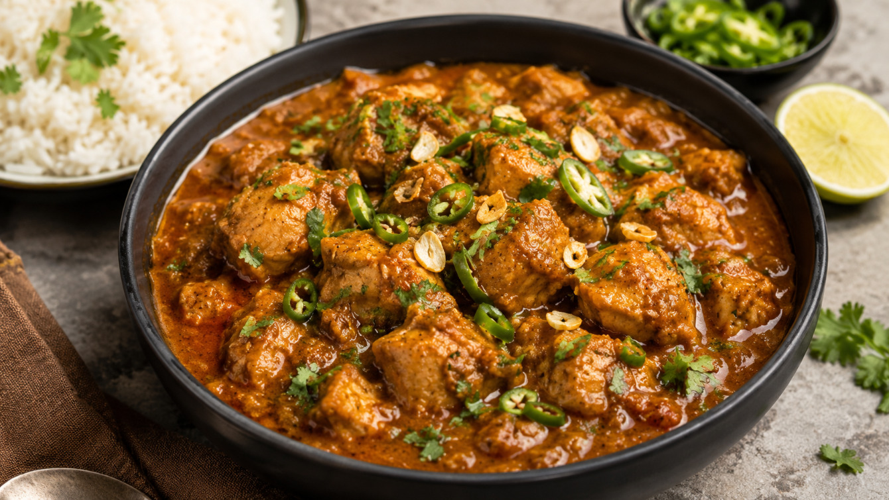

# Example: Cookbook photo input (Indian curry)

## Input

Upload a photo of a cookbook page:



## Output

The parser reads the text from the photo, structures it as schema.org/Recipe JSON-LD, and applies all formatting rules:

```json
{
  "@context": "https://schema.org",
  "@type": "Recipe",
  "name": "Kip met chilipeper en knoflook",
  "description": "Kipcurry met groene chilipepers en veel knoflook; pittig maar niet overheersend.",
  "recipeYield": "4 personen",
  "recipeCategory": [
    "Hoofdgerecht"
  ],
  "keywords": [
    "tijd | 30-60",
    "keuken | indiaas",
    "eiwit | kip",
    "pittig | medium"
  ],
  "tool": [
    "pan"
  ],
  "recipeIngredient": [
    "4 el koolzaadolie (of kruidenolie)",
    "15 teentjes knoflook, in dunne plakjes",
    "1 ui, fijngesneden",
    "1/2 tl zout",
    "2 el knoflook-gemberpasta",
    "3 groene chilipepers, in dunne ringetjes (of meer), plus extra ter garnering (optioneel)",
    "1 tl chilipoeder",
    "2 el kruidenpoeder",
    "2 el tandoori masala",
    "125 ml tomatenpuree",
    "500 ml basiscurrysaus, verwarmd",
    "800 g tandoori kip tikka",
    "125 ml kookbouillon, van voorgegaarde gestoofde kip of specerijenbouillon",
    "1 tl fenegriekblad [gedroogd] (methi)",
    "1 klein bosje koriander [blad], fijngehakt",
    "knoflookvlokken, ter garnering (optioneel)"
  ],
  "recipeInstructions": [
    {
      "@type": "HowToStep",
      "text": "Verhit de koolzaad- of kruidenolie in een pan op middelhoog vuur en voeg de knoflook toe. Blijf roeren tot de knoflook zacht en lichtbruin is (niet laten verbranden)."
    },
    {
      "@type": "HowToStep",
      "text": "Voeg de ui toe en bak ongeveer 3 minuten tot de ui zacht en glazig is. Bestrooi met wat zout zodat het vocht vrijkomt."
    },
    {
      "@type": "HowToStep",
      "text": "Roer de knoflook-gemberpasta en de chilipepers erdoor en bak ongeveer 20 seconden."
    },
    {
      "@type": "HowToStep",
      "text": "Zet het vuur hoger, voeg de gemalen specerijen en de tomatenpuree toe en bak al roerend nog 30 seconden."
    },
    {
      "@type": "HowToStep",
      "text": "Voeg de helft van de basiscurrysaus toe en breng aan de kook. Roer alleen als de saus duidelijk gaat aanbakken; schraap eventueel gekaramelliseerde saus van de zijkant van de pan en roer terug."
    },
    {
      "@type": "HowToStep",
      "text": "Voeg de rest van de basiscurrysaus, de kip en de bouillon toe en laat dit zonder te roeren zachtjes koken tot de kip warm is en de saus de gewenste consistentie heeft."
    },
    {
      "@type": "HowToStep",
      "text": "Roer de gedroogde fenegriek erdoor en breng op smaak met zout."
    },
    {
      "@type": "HowToStep",
      "text": "Bestrooi met de fijngehakte koriander, de knoflookvlokken en eventueel nog wat ringetjes chilipeper."
    }
  ]
}
```

## What to notice

- **Photo input.** The parser reads text directly from a cookbook photo. No URL or typed text needed.
- **Page references removed.** The original cookbook text contains references like `(zie pag. 7)`, `(zie pag. 18)`, etc. These are stripped from the output as they have no meaning outside the book.
- **Foreign ingredient name.** `fenegriekblad [gedroogd] (methi)` combines a DB qualifier in square brackets with the Hindi name in round brackets (notes).
- **DB qualifiers.** `[gedroogd]` and `[blad]` match Mealie ingredient database entries.
- **Cuisine tag.** `keuken | indiaas` is assigned because tandoori masala and the cooking style clearly indicate Indian cuisine.
- **No URL or image.** Since the input is a photo, there is no `url` or `image` field (unlike URL-based examples).
- **Optional ingredients.** `(optioneel)` and `(of meer)` are kept as notes in round brackets.

## Generated image

After parsing, type `/image` to generate a food photo:


